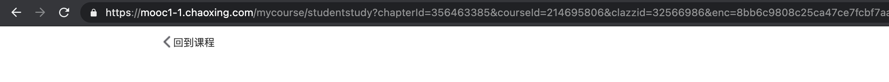

# 超星（学习通）自动刷课脚本


## Install

使用 python 进行编写，因此需要 python 相关环境。

```bash
git clone https://github.com/techial1042/chaoxin-auto-flush.git
cd chaoxin-auto-flush
pip install requests
```

## Config

1. 使用 `vscode` 打开 `main.py` 文件。

2. 打开超星网页，查看 `URL`，找到 `courseId`，`clazzid` 和 `chapterId`，填在 `main.py` 中。



```python
if __name__ == '__main__':
    chao_xin = ChaoXing(username='', # 账号名
                        password='', # 密码
                        clazz_id='', # clazzid
                        course_id='', # courseId
                        chapter_id='') # chapterId
    chao_xin.play()
    chao_xin.dump_session()
```


## Run

```bash
python main.py
```

